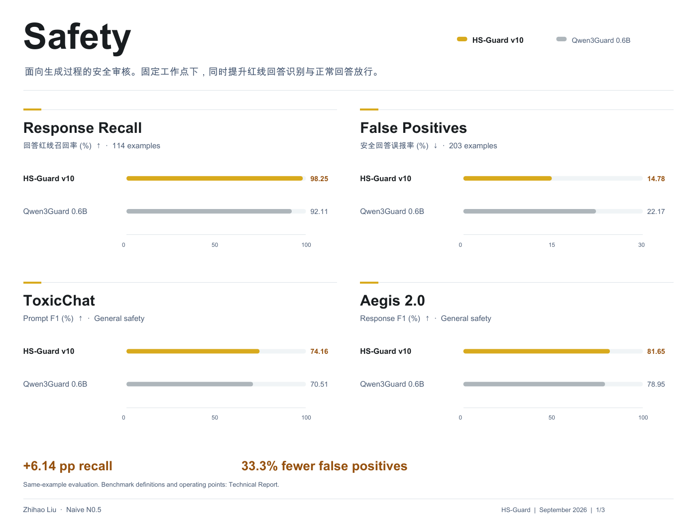
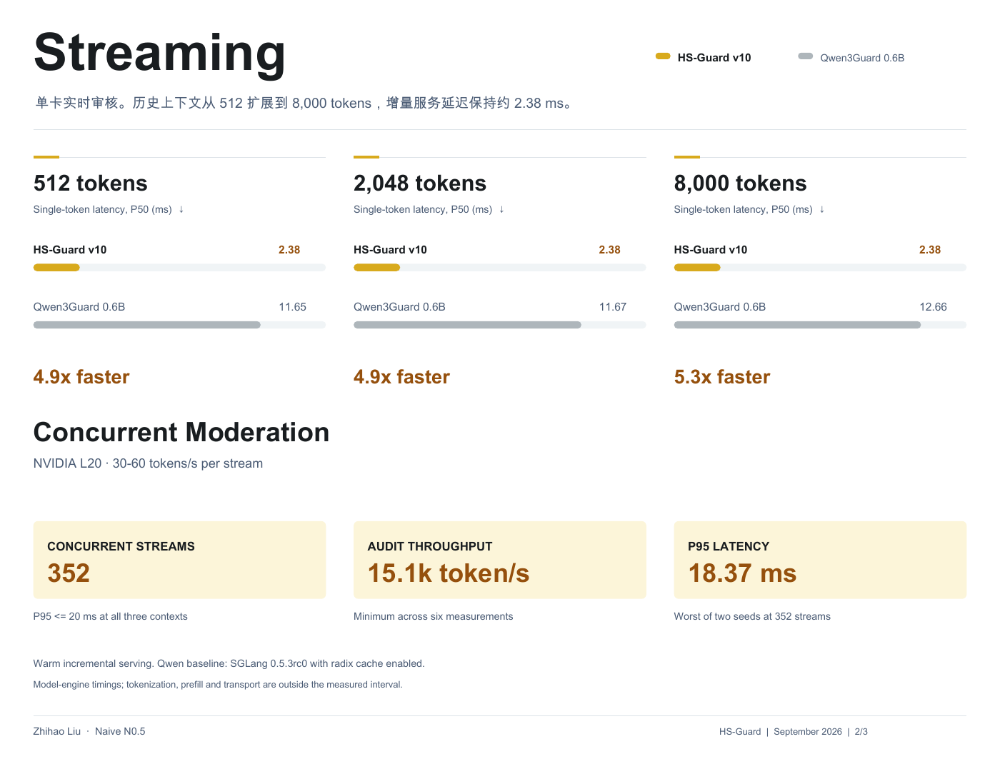

# HS-Guard

**Hybrid-state streaming safety moderation**

Zhihao Liu · Naive N0.5

[Model weights](https://huggingface.co/KrisLiu16/HS-Guard-v10) · [Technical report](docs/technical_report.pdf) · [Evaluation](docs/EVALUATION.md) · [Engine](docs/ENGINE.md)

HS-Guard scores prompts and live response tokens with a 754.5M-parameter hybrid backbone. It combines recurrent state with a 512-token attention window, two role-specific classifiers, and separate red-line and general-safety branches. It does not generate text.



### Selected results

| Metric | HS-Guard v10 | Qwen3Guard-Stream-0.6B |
|---|---:|---:|
| Response red-line recall, n=114 | **98.25%** | 92.11% |
| Safe-response false-positive rate, n=203 | **14.78%** | 22.17% |
| ToxicChat held prompt F1, general branch | **74.16** | 70.51 |
| Aegis 2.0 held response F1, general branch | **81.65** | 78.95 |

### Streaming performance



On one NVIDIA L20, the tested streaming engine measures **2.38 ms** single-token median service latency and supports 352 simulated concurrent streams, with P95 no higher than 18.37 ms and throughput at least 15,075 token/s across initial contexts of 512, 2,048 and 8,000 tokens.

See the [engine benchmark setup](docs/ENGINE.md#measured-performance) for timing scope and the SGLang baseline. The report defines operating points, datasets and timing. These are selected results, not a universal ranking. The reference and streaming paths have separate numerical checks.

## Install

The verified environment is Linux, NVIDIA L20, CUDA 12.8 and Python 3.11. Other CUDA GPUs have not been validated in this release. Install a C compiler for Triton JIT compilation.

```bash
python -m venv .venv
source .venv/bin/activate
pip install torch==2.7.1 --index-url https://download.pytorch.org/whl/cu128
pip install git+https://github.com/KrisLiu16/HS-Guard.git
```

## Score a message

```python
from hs_guard import load_model, score_messages

model, tokenizer, metadata = load_model("KrisLiu16/HS-Guard-v10")
result = score_messages(model, tokenizer, metadata, [
    {"role": "user", "content": "How can I organize my study schedule?"}
])
print(result)
```

Use `head="general"` when loading for broader harmfulness scoring. The default `redline` head follows a project-specific policy; the two branches are not interchangeable. Class order is `safe`, `unsafe`, `controversial`; cut score is `1 - p(safe)`.

```bash
hs-guard --text "How can I organize my study schedule?"
# Integrity verification performs no model inference:
hs-guard --model ./models/HS-Guard-v10 --verify-only
```

## Stream stable tokens

```python
from hs_guard import StreamingGuard

guard = StreamingGuard(model, metadata, max_slots=16)
# Each slot is one conversation. Token IDs must use the released tokenizer.
outputs = guard.step([(0, [1234]), (1, [5678, 9012])], role="assistant")
print(outputs)
guard.reset()  # Clear every slot before reassigning the whole batch.
```

See [examples/stream.py](examples/stream.py) for serialization and target-message boundaries. Pass only stable token IDs. Text streaming integrations must handle tokenizer-boundary changes before committing tokens. `step` returns per-token scores; callers apply the documented prompt-end or response-max decision rule.

## Release contents

- Complete classifier weights and tokenizer assets on Hugging Face.
- Reference complete-message inference and the CUDA Graph / Triton streaming engine.
- Aggregate evaluation results, technical report and usage examples.

Training corpora, raw evaluation examples, private policy dictionaries and deployment infrastructure are not distributed. Category outputs are not a validated release feature. See the model card for policy scope and limitations.

## Licenses

**Code:** Apache-2.0. FLA-derived kernel portions retain their MIT notice in [third_party_licenses](third_party_licenses/FLA-MIT.txt).

**Weights:** CC BY-NC 4.0, for noncommercial research. Training provenance includes noncommercially licensed data. The Qwen3.5 base-model attribution and Apache-2.0 notice are retained in the model repository. Code licensing does not grant commercial rights to these weights.

## Citation

```bibtex
@techreport{liu2026hsguard,
  title={HS-Guard Technical Report: Policy-Specific Streaming Moderation with a Hybrid-State Classifier},
  author={Liu, Zhihao and {Naive N0.5}},
  year={2026},
  url={https://github.com/KrisLiu16/HS-Guard}
}
```
